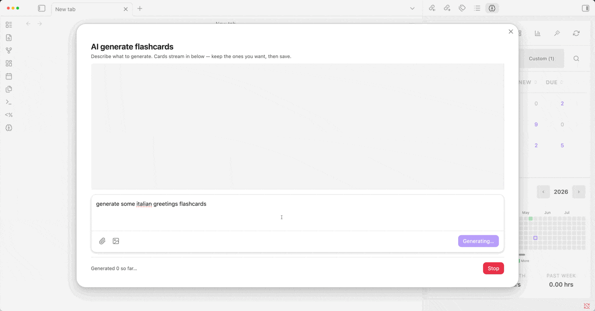

# Decks   

[English](./README.md) · **Deutsch** · [Español](./README.es.md) · [Français](./README.fr.md) · [Italiano](./README.it.md) · [Русский](./README.ru.md) · [Türkçe](./README.tr.md) · [Shqip](./README.sq.md) · [العربية](./README.ar.md) · [हिन्दी](./README.hi.md) · [中文](./README.zh.md) · [繁體中文](./README.zh-TW.md) · [日本語](./README.ja.md)

**Verwandle deine Obsidian-Notizen in Karteikarten. Keine spezielle Syntax. Kein separater Stapel zum Aufbauen.**

Markiere eine Datei mit `#decks`. Jede `##`-Überschrift wird zur Vorderseite einer Karte; der Text darunter wird zur Rückseite. Tabellen, Bildverdeckung und `==cloze==`-Hervorhebungen funktionieren auf die gleiche Weise. Die Planung übernimmt FSRS-6 — der moderne Algorithmus für räumliche Wiederholung.


[Discord](https://discord.com/channels/686053708261228577/1497268419861418035) · [Versionshinweise](./release-notes/) · [Spendier mir einen Kaffee](https://www.buymeacoffee.com/dscherdil0)

## Warum Decks

- **Deine Notizen sind bereits der Stapel.** Markiere eine Datei — jede Überschrift auf der gewählten Ebene wird zur Vorderseite und der Text darunter zur Rückseite. Wer von Anki kommt, muss nichts doppelt schreiben.
- **Vier Formate, keine Syntax zu lernen.** Überschriften, zweispaltige Tabellen, Bildverdeckung und `==cloze==` aus Hervorhebungen, die du bereits verwendest.
- **FSRS-native Planung.** Drei Profile (Standard / Intensiv / Trainiert), Retentionsziele pro Tag, kein SM-2-Ballast.
- **Algorithmus-Feinabstimmung.** Ein-Klick-Optimierer trainiert die FSRS-Gewichte auf deinem eigenen Wiederholungsverlauf — bessere Planung für deine persönliche Vergessenskurve, vollständig clientseitig.
- **Echte Multi-Geräte-Synchronisierung.** Die Datenbank verbindet sich automatisch über iCloud/Dropbox — wiederhole auf Handy und Desktop, ohne dass dein Verlauf verloren geht.
- **Für Mobilgeräte entwickelt.** Touch-optimierte Wiederholungs-UI, Safe-Area-bewusst, täglich auf Smartphones getestet.

## 60-Sekunden-Schnellstart

1. Installiere **Decks** aus den Community-Plugins und aktiviere es.
2. Öffne eine beliebige Notiz. Füge `#decks` in das Frontmatter oder als Inline-Tag ein.
3. Schreibe eine `##`-Überschrift, dann einen Absatz darunter. Wiederhole das für so viele Karten wie du möchtest:

   ```markdown
   ---
   tags: [decks/spanisch]
   ---

   ## Was bedeutet "Hola"?

   Hallo.

   ## Wie sagt man "Danke" auf Spanisch?

   Gracias.
   ```

4. Klicke auf das **Hirn-Symbol** in der Seitenleiste, um das Decks-Panel zu öffnen. Klicke auf deine Datei. Beginne mit dem Wiederholen.

Der Dateiname wird zum Stapelnamen. Karten synchronisieren sich automatisch, wenn du die Notiz speicherst.

## Kartenformate

Decks unterstützt vier Arten, Karten zu schreiben. Wähle die, die deinem Stil am besten entspricht.

<details>
<summary><b>Überschrift + Absatz</b> — der Standard. Jede Überschrift auf der konfigurierten Ebene (standardmäßig H2) ist eine Vorderseite; der darunterliegende Text ist die Rückseite.</summary>

```markdown
---
tags: [decks/spanisch]
---

## Was bedeutet "Hola" auf Deutsch?

Hallo.

## Wie sagt man "Danke" auf Spanisch?

Gracias.
```

Der Dateiname wird zum Stapelnamen. Die Überschriftenebene ist pro Profil konfigurierbar (standardmäßig H2). Überschriften oberhalb der konfigurierten Ebene werden nicht zu Karten — sie werden als Breadcrumb-Pfad (z. B. `Kapitel 1 > Abschnitt 2`) zur Kontextanzeige an jede Karte angehängt.

Füge einer Überschrift-Absatz-Karte optionale **Notizen** hinzu — mit einem Obsidian-Kommentar (`%%ein Hinweis%%`) irgendwo im Text oder nach einem `---`-Trenner am Ende. Notizen werden bei Bedarf (Taste **N**) während der Wiederholung angezeigt.

</details>

<details>
<summary><b>Tabellen</b> — zweispaltige Markdown-Tabellen mit optionaler Notizen-Spalte.</summary>

```markdown
## Begriffe

| Frage                  | Antwort                                             |
| ---------------------- | --------------------------------------------------- |
| Was ist Photosynthese? | Der Prozess, mit dem Pflanzen Sonnenlicht umwandeln |
| Definiere Schwerkraft  | Die Kraft, die Objekte zueinander zieht             |
```

- Erste Spalte = Vorderseite, zweite Spalte = Rückseite. Die Kopfzeile wird ignoriert.
- Tabellen müssen direkt unter einer Überschrift stehen (keine anderen Absätze dazwischen).
- Füge eine dritte „Notizen"-Spalte für Hinweise/Eselsbrücken hinzu, die per Umschalter (Taste **N**) während der Wiederholung sichtbar werden.

</details>

<details>
<summary><b>Lückentexte</b> — hebe Text mit <code>==text==</code> hervor, um ihn auszublenden.</summary>

```markdown
## Das Sonnensystem

Die ==Sonne== ist der Stern im Zentrum unseres Sonnensystems. Der sonnennächste Planet ist ==Merkur==, und der größte Planet ist ==Jupiter==.
```

Jede Hervorhebung wird zu einer Karte. Während der Wiederholung wird die aktive Lücke als `[...]` angezeigt; tippe zum Aufdecken. Lücken funktionieren auch innerhalb von Tabellenzellen. Zwei Kontextmodi pro Profil (andere Lücken verbergen oder anzeigen). Standardmäßig aktiviert.

</details>

<details>
<summary><b>Bildverdeckung</b> — verdecke Bereiche eines Bildes und rufe ab, was darunter liegt. Zwei Wege: interaktiv (Felder zeichnen) oder eine nummerierte Liste.</summary>

**Interaktiv (empfohlen).** Führe den Befehl **„Bildverdeckung an Cursorposition erstellen"** aus, wähle ein Bild und zeichne dann direkt im Editor Felder darauf. Gib für jedes Feld eine Markdown/LaTeX-Antwort ein oder lasse es leer, um nur eine im Bild enthaltene Beschriftung zu verdecken. Es wird als eigenständiger `decks-occlusion`-Codeblock gespeichert (Koordinaten in Prozent, daher auf jedem Gerät skalierbar):

````markdown
```decks-occlusion
image: "[[heart.png]]"
version: 2
masks:
  - id: m1
    x: 12.5
    y: 30
    w: 18
    h: 9.5
    answer: "Linke **Herzkammer**"
  - id: m2
    x: 55
    y: 22
    w: 14
    h: 8
    answer: ""
```
````

Jedes Feld ist eine Karte. Bei der Wiederholung ist das Feld auf der Vorderseite verdeckt und auf der Rückseite aufgedeckt (mit seiner Antwort); in der Leseansicht siehst du das vollständig beschriftete Diagramm. Jederzeit über die **Bearbeiten**-Schaltfläche des Blocks oder den Karteikarten-Manager bearbeitbar.

**Nummerierte Liste (einfach).** Ein Bild-Embed gefolgt von einer nummerierten Liste funktioniert ebenfalls:

```markdown
## Knochen des Arms

![[arm_bones.png]]

1. ==Oberarmknochen==
2. ==Speiche==
3. ==Elle==
```

Jeder Listeneintrag ist eine Karte; das Bild wird auf der Vorderseite gezeigt und der passende Eintrag auf der Rückseite ausgeblendet.

Beides baut auf Lückentexten auf – Cloze muss also im Profil aktiviert sein und der Block muss unter einer ausgewerteten Überschrift stehen.

</details>

<details>
<summary><b>Mehr: Titelformat, umgekehrte Karten, Tags pro Karte</b></summary>

**Titelformat** — der Dateiname wird zur Vorderseite, die gesamte Datei zur Rückseite. Setze „Titel" als Überschriftenebene in deinem Profil.

**Umgekehrte Karten** — füge `reverse: true` zum Frontmatter einer Datei hinzu, um automatisch eine umgekehrte Kopie jeder Karte zu erstellen. Der Fortschritt wird pro Richtung separat verfolgt.

**Tags pro Karte** — füge `#tag` direkt in Überschriften ein (z. B. `## Was ist Photosynthese? #pflanzen #gymnasium`). Tags werden aus der angezeigten Vorderseite entfernt, während der Wiederholung als Chips angezeigt und auf Tabellenzeilen sowie umgekehrte Karten übertragen. Erstelle „Filter-Stapel", die jede Karte mit einem bestimmten Tag aus deinem gesamten Vault zusammenführen.

</details>

### Canvas-Stapel

Erstelle Karten auf einer Obsidian-Canvas-Datei (`.canvas`) statt in einer Markdown-Datei. Jedes Canvas im konfigurierten Ordner wird zu einem Stapel; jeder Textknoten darin wird mit denselben vier Karten-Formaten oben analysiert. Konfiguration unter **Einstellungen → Canvas-Stapel**: Canvas-Ordner und Canvas-Stapel-Tag (Standard `#decks/canvas`). „Quelle öffnen" beim Review öffnet das Canvas und fokussiert den entsprechenden Textknoten. Beim ersten Installieren (oder Aktualisieren) wird automatisch ein `Decks — Canvas Erste Schritte.canvas` im Ordner `Canvas decks/` erstellt.

**Räumliche Karten (Spatial cards)**: Verbinde Textknoten mit Kanten — jede Kante wird zu einer Karteikarte: der Ausgangsknoten ist die Vorderseite (Frage), der Zielknoten die Rückseite (Antwort), und das Kantenlabel ist ein optionaler Hinweis. Ketten (A → B → C), Eins-zu-viele- und Viele-zu-eins-Verbindungen funktionieren alle; nicht verbundene Knoten werden weiterhin mit den vier obigen Formaten analysiert. Details in **[docs/CANVAS_DECKS.md](docs/CANVAS_DECKS.md)**.


## Vorlagen

Rendere die Zeilen einer Tabelle über ein Kartendesign, das du einmal erstellst. Schreibe es in HTML/CSS oder
Markdown, setze `{{Column}}`-Platzhalter ein und binde es per Tag an deine Tabellen — eine Vorlage gestaltet
jede passende Zeile.

```decks-html-front
<ruby>{{Word}}<rt>{{Reading}}</rt></ruby>
```

Wähle unter **Einstellungen → Vorlagen** einen Ordner und versieh eine Vorlagendatei sowie die Überschrift
der Tabelle mit demselben Tag — fertig. Vorlagen unterstützen Vorder-/Rück-/Notizseiten in HTML oder
Markdown, werden in einer bereinigten, themenbewussten Sandbox gerendert und stellen CSS-Variablen
(`--padding`, `--align`, `--bg`, …) für die volle Layout-Kontrolle bereit — von angenehmen Lesekarten bis zu
randlosen eigenen Designs. Tabellen ohne passende Vorlage verwenden weiterhin die normalen Spalten.

Siehe **[docs/TEMPLATES.md](docs/TEMPLATES.md)** für die vollständige Anleitung und Beispiele.

## Prüfungsstapel

Führe einen Stapel als benotete Prüfung durch: eine gezogene Auswahl von Fragen, die in einer Sitzung in
beliebiger Reihenfolge beantwortet wird, mit einer Ergebnisauswertung — und optional einem Zeitlimit und
einer Bestehensgrenze — am Ende. Prüfungen werden pro Profil aktiviert und fügen ein Erstellungsformat
hinzu: eine Überschrift gefolgt von einer Aufgabenliste wird zur Multiple-Choice-Karte.

```markdown
## Welches Element ist ein Edelgas?

- [ ] Sauerstoff
- [x] Argon
- [ ] Stickstoff
```

`- [x]` markiert eine richtige Option; mehrere Häkchen machen die Frage zur Mehrfachauswahl.

- Versieh eine Notiz mit dem Unter-Tag `exams` deines Stapel-Tags (standardmäßig `#decks/exams`), um das
  vorinstallierte **Exams**-Profil zu verwenden, oder aktiviere **Prüfungsfragen** in einem beliebigen
  Profil.
- Starte über das Menü des Stapels (**⋮ → Prüfung starten**) oder per Klick auf einen Prüfungsstapel; ein
  Einrichtungsdialog zeigt die Fragenanzahl und lässt dich die Prüfungseinstellungen anpassen.
- Neben Multiple-Choice werden Überschrift-Antwort-Karten und Tabellenzeilen als Fragen mit Texteingabe
  gestellt, und Lückentextkarten zeigen den Satz mit den Hervorhebungen als auszufüllende Lücken.
- Eingetippte Antworten werden exakt, tolerant gegenüber kleinen Tippfehlern oder per Selbsteinschätzung
  bewertet; die Prüfungsvorgaben (Fragenanzahl, Zeitlimit, Bestehensgrenze, Mischen, Zeitpunkt des
  Feedbacks, Optionsbeschriftungen) liegen im Profil.
- Abgeschlossene Prüfungen werden in der Plugin-Datenbank gespeichert, über Geräte hinweg zusammengeführt
  und in Sicherungen einbezogen.

Ein Stapel „Demo-Prüfung" mit allen Fragenformaten wird bei der ersten Installation erstellt (oder über den
Befehl **„Demo-Prüfungsstapel erstellen"**).

Siehe **[docs/EXAM_DECKS.md](docs/EXAM_DECKS.md)** für die vollständigen Erstellungsregeln.

## Was du bekommst

- Durchsuchen-Modus und zeitlich begrenzte Wiederholungssitzungen mit Tageslimits.
- Profile pro Tag (Standard / Intensives FSRS, Retentionsziel, Tagesquoten).
- Benutzerdefinierte Stapel aus Filterregeln — z. B. jede Karte mit dem Tag `#gymnasium`.
- Prüfungsmodus: benotete Prüfungssitzungen mit Multiple-Choice-, Texteingabe- und Lückentextfragen.
- Statistiken: Heatmap, Retention, Vorhersage zukünftiger Fälligkeiten, Intervalle, stündliche Aufschlüsselung, Antwortschaltflächen-Statistik.
- Anki-Export, automatische Sicherungen, Multi-Geräte-Merge-Sync.
- Tastenkürzel: **Leertaste** zum Umdrehen, **1–4** zum Bewerten.

## Multi-Geräte-Sync

Decks synchronisiert sich zusammen mit deinem Vault — iCloud Drive, Obsidian Sync, Dropbox, Syncthing — alles, was den Vault-Ordner teilt, funktioniert.

Das Plugin verwendet zwei Dateien:

- **`<Plugin-Ordner>/flashcards.db`** — die SQLite-Datenbank mit dem FSRS-Status jeder Karte und dem vollständigen Wiederholungsverlauf. Dies ist der Cold-Storage-Snapshot, der etwa alle 30 Minuten bei neuer Aktivität auf die Festplatte geschrieben wird (sowie beim Wechsel in den Hintergrund / Entladen der App).
- **`<deviceId>.deckssynclog`** — eine kleine, nur-anhängende JSONL-Datei pro Gerät im Vault-Stammverzeichnis. Jede Zustandsänderung — Bewertung einer Karte, Bearbeitung eines Profils, Erstellen eines benutzerdefinierten Stapels, Start/Ende einer Wiederholungssitzung — wird hier als eine kurze Zeile aufgezeichnet. Andere Geräte lesen diese Dateien beim Fokus der App und spielen die Einträge in ihrer eigenen Datenbank ab.

Die benutzerdefinierte Endung `.deckssynclog` hält die Datei aus Obsidians Datei-Explorer fern; du siehst sie im Finder/Dateien, aber sie erscheint nie als Notiz. iCloud und andere Datei-Sync-Anbieter übertragen diese kleinen Textdateien **erheblich schneller** als die binäre Datenbank — typischerweise Sekunden statt Minuten — weshalb die geräteübergreifende Verzögerung („Ich habe das gerade auf meinem Mac bewertet, jetzt sehe ich es auf dem iPhone") meist etwa 15–30 Sekunden statt 1–2 Minuten beträgt.

Das Log kürzt sich beim Laden des Plugins automatisch auf die letzten 30 Tage. Langlaufender, geräteübergreifender Zustand (Monate oder Jahre an Wiederholungsverlauf) wird in der binären Datenbank aufbewahrt, die nach ihrem eigenen, langsameren Zeitplan über deinen Datei-Sync-Anbieter synchronisiert wird.

Falls dein Sync-Anbieter Konfliktdateien anlegt (z. B. iCloud `<deviceId> (Macs konfliktbehaftete Kopie 2026-05-13).deckssynclog`), erkennt das Plugin sie, übernimmt die einzigartigen Einträge und benennt das Original in `*.consumed-<timestamp>` um, damit es nicht erneut verarbeitet wird.

## Personalisierte Planung

FSRS wird mit sinnvollen Standardwerten ausgeliefert, die direkt gut funktionieren. Sobald du etwa 100 Wiederholungen gesammelt hast, kannst du die 21 Gewichte des Algorithmus auf deinem eigenen Wiederholungsverlauf trainieren und Karten-Pläne erhalten, die auf deine spezifische Vergessenskurve zugeschnitten sind — ähnlich wie Anki-Desktop es macht, aber clientseitig, ohne Server, ohne Telemetrie.

**Einstellungen → Algorithmus-Feinabstimmung → Parameter optimieren.** Das Training läuft bei typischen Stapeln in Sekunden; du siehst einen Vorher-Nachher-Log-Loss-Vergleich, klicke „Anwenden", um die trainierten Gewichte zu nutzen, oder „Verwerfen", um die Standardwerte beizubehalten. Du kannst jederzeit erneut trainieren, um die Gewichte zu verfeinern, wenn du mehr Wiederholungen sammelst.

Trainierte Gewichte sind global, werden aber pro Profil angewendet — wähle **Trainiert** im FSRS-Profil-Dropdown eines Profils, um es zu aktivieren. Intensive Profile nutzen weiterhin ihre Sub-Tages-Standardwerte; vorhandene Kartendaten bleiben durch das Training erhalten.

<details>
<summary>Wie es unter der Haube funktioniert</summary>

Der Optimierer entspricht der Open-Spaced-Repetition-Referenzmethodik: Adam-Optimierer über Binary-Cross-Entropy-Verlust, kosinus-annealing-Lernrate, Parameter-Clipping gegen die veröffentlichten FSRS-6-Grenzwerte. Die Anzahl der Schritte skaliert mit deinem Wiederholungsverlauf (mehr Wiederholungen → mehr Iterationen).

Die Implementierung wurde gegen die veröffentlichte FSRS-6-Spezifikation validiert (1396/1396 Forward-Pass-Fälle stimmen bitgenau überein) und gegen 443M anonymisierte Anki-Wiederholungen benchmarkt — die Kalibrierung der mitgelieferten Standardwerte stimmt mit der empirischen Wiedererkennung auf 0,8 Prozentpunkte überein. Siehe [docs/FSRS_OPTIMIZER.md](./docs/FSRS_OPTIMIZER.md) für die vollständige Beschreibung: Vergleich mit dem Referenz-Benchmark, was bei unterschiedlichen Stapelgrößen zu erwarten ist und bekannte Einschränkungen.

</details>

## Einstellungen

Öffne **Einstellungen → Decks** für Tageslimits, Retentionsziele, Suchpfade, Sitzungsdauer und Backup-Optionen. Tag-spezifische Überschreibungen über das Zahnrad-Symbol auf jedem Stapel.

<details>
<summary>Alle Einstellungen</summary>

**Profil-Einstellungen** (Profile verwalten im Stapel-Panel):

- Neue Karten pro Tag, Wiederholungskarten pro Tag (pro Stapel)
- Retentionsziel (Standard 90%)
- FSRS-Profil: Standard, Intensiv oder Trainiert (Trainiert verfügbar nach Parameter-Optimierung)
- Überschriftenebene für das Parsen (oder „Titel", um den Dateinamen zu verwenden)
- Wiederholungsreihenfolge: älteste fällige zuerst oder zufällig
- Lückentexte: standardmäßig aktiviert
- Lücken-Kontext: verborgen oder offen

**Wiederholungs-Einstellungen:** Sitzungsdauer (1–60 Min), Tageswechselstunde (Standard 4 Uhr morgens), Schalter für Tastenkürzel.

**Parsing-Einstellungen:** den gesamten Vault scannen oder auf einen Ordner beschränken.

**Sonstiges:** Hintergrund-Aktualisierungsintervall, Anzahl automatischer Backups, Debug-Logging.

</details>

## Umstieg von Spaced Repetition

Du nutzt bereits das **Spaced Repetition**-Plugin? Du kannst zu Decks wechseln, **ohne deine Karten oder deinen Wiederholungsverlauf zu verlieren** — und genau dort weiterlernen, wo du aufgehört hast.

Öffne den Migrationsassistenten über die Werkzeugleiste des Stapel-Panels (das Würfel-Symbol) oder führe den Befehl **„Migrate from Spaced Repetition plugin“** aus.

**Deine ursprünglichen Notizen werden nie verändert.** Die Migration ist additiv: Sie schreibt neue Dateien in einen von dir gewählten Zielordner (und bildet deine Struktur nach) und lässt deine Quellnotizen genau so, wie sie sind. Ein erneutes Ausführen des Assistenten überschreibt einfach die von ihm erzeugten Dateien.

**So funktioniert es**

1. **Wähle einen Quellordner** zum Durchsuchen (oder lass ihn leer, um den gesamten Vault zu durchsuchen) und einen Zielordner für die Ausgabe. Decks findet jede Notiz mit alten Karten — einzeilig (`Front :: Back`), umgekehrt (`Front ::: Back`), mehrzeilig (`?` / `??`), Lückentexte (`==…==` / `{{…}}`) — und Ganz-Notiz-Wiederholungen (das `#review`-Tag).
2. **Jede Notiz wird in zwei saubere Dateien aufgeteilt.** Ein **Lernkarten-Stapel** (`<Notiz> (Lernkarten)`) enthält die extrahierten Karten im Standard-Decks-Format, und eine **lesbare Notiz** bewahrt den Fließtext — wobei die Karten-Syntax in normalen Text *aufgelöst* wird (`::` / `:::` werden zu „ — “, `?` / `??` verbinden Frage und Antwort, und `==…==` / `{{…}}`-Lückentexte werden auf ihre Antwort zurückgesetzt). Deine konfigurierten Trennzeichen werden berücksichtigt, sodass dies auch dann funktioniert, wenn du sie angepasst hast. Nichts wird entfernt — deine Lese-Notiz bleibt vollständig.
3. **Die Dateien werden im Frontmatter gegenseitig verlinkt.** Die lesbare Notiz erhält eine `Lernkarten`-Eigenschaft, die auf ihren Stapel zeigt, und eine `Ursprungsnotiz`-Eigenschaft, die auf das Original zurückverweist; der Stapel erhält ebenfalls eine `Ursprungsnotiz`-Eigenschaft. Falls eine Notiz bereits einen dieser Eigenschaftsnamen verwendet, überschreibt der Assistent ihn, anstatt ein Duplikat zu erstellen. Deine Tags bleiben erhalten — das alte Basis-Tag (z. B. `#flashcards`) wird in dein konfiguriertes Decks-Tag übersetzt.
4. **Umgekehrte Karten werden zu zwei Karten.** Eine `Front ::: Back`-Karte wird in eine Vorwärtskarte und eine vertauschte Karte in **derselben** Stapeldatei aufgeteilt, sodass jede Richtung unabhängig geplant wird.
5. **Verschachtelte Strukturen werden in Kontext überführt.** SR behandelt übergeordnete Überschriften und verschachtelte Listenpunkte als Kontext einer Karte. Decks erfasst diesen gesamten Pfad in der Vorderseite der Karte — z. B. wird ein tief verschachteltes `Function :: Powerhouse` zu `Cell Anatomy > Mitochondria > … > Function` — dargestellt auf der einzelnen Überschriftsebene deines Profils (eine alleinstehende Notiztitel-H1 wird weggelassen). Wähle eine beliebige Ebene über die vorinstallierten **Heading 1–6**-Profile.
6. **Intelligentes Auto-Routing wählt das beste Layout.** Kurze einzeilige Karten werden zu Zeilen in einer kompakten **Tabelle** (kein endloses Scrollen bei Vokabeln); mehrzeilige Karten — mit Codeblöcken, Listen oder Mathematik — werden zu **Überschriften**, damit ihre Formatierung erhalten bleibt. Du kannst dies im Dialog auf *nur Überschriften* oder *nur Tabellen* umstellen.
7. **Auch Ganz-Notiz-Wiederholungen werden migriert.** Notizen, die du als Ganzes wiederholt hast (das `#review`-Tag), werden zu Decks-Karten im **Titelmodus** (Dateiname = Vorderseite, die gesamte Notiz = Rückseite) unter einem eigenen `…/review`-Profil. Ihr Zeitplan wird aus dem `sr-*`-Frontmatter der Notiz oder ihrer Markierung am Dateiende gelesen.
8. **Dein Planungszustand wird in FSRS-6 übersetzt.** Decks liest die alten `<!--SR:-->`-Metadaten — SM-2 (`due, interval, ease`) oder bereits FSRS — und ordnet sie einem Stabilitäts-/Schwierigkeits-/Fälligkeitszustand zu. Umgekehrte Karten behalten **zwei getrennte** Verläufe (Lesen vs. Abruf), genau so, wie das ursprüngliche Plugin sie gespeichert hat.
9. **Für jede migrierte Karte wird ein Wiederholungsprotokoll geschrieben**, sodass die Karten in dem Moment, in dem sie in Decks erscheinen, bereits am richtigen Datum mit dem richtigen Intervall fällig sind — du machst weiter, du fängst nicht von vorne an.

Wähle im Dialog ein Profil (oder verwende das Standardprofil) — seine Überschriftsebene und Planungseinstellungen werden auf die migrierten Stapel angewendet.

## Umstieg von Anki

Wechselst du von Anki? Du kannst deine gesamte Sammlung in Decks übernehmen — **ohne Karten, Medien oder Lernverlauf zu verlieren** — und mit FSRS-6 weiterlernen.

Exportiere in Anki deinen Stapel (oder die ganze Sammlung) als **`.apkg`** (**Datei → Exportieren**, Format *Anki-Kartenstapel-Paket*, mit aktivierten Optionen **Medien einschließen** und **Planungsinformationen einschließen**). Öffne dann den Importer über die Symbolleiste des Stapel-Panels oder führe den Befehl **„Import from Anki"** aus, wähle die Datei und einen Zielordner und importiere. Sowohl alte als auch neue (komprimierte) `.apkg`-Exporte funktionieren.

**Deine Anki-Sammlung wird nie verändert.** Der Import ist additiv: Er schreibt neue Dateien in einen von dir gewählten Zielordner, verschachtelt unter dem Tag `#decks/anki`, und lässt die Quell-`.apkg` unangetastet. Ein erneuter Import derselben Datei überschreibt die erzeugten Dateien und aktualisiert ihre Medien — du kannst ihn also jederzeit wiederholen.

**So funktioniert's**

1. **Wähle die `.apkg` und einen Zielordner.** Decks entpackt sie im Speicher, liest die eingebettete Anki-Sammlung (altes oder neueres komprimiertes Format) und kopiert jede referenzierte Mediendatei in einen `media/`-Ordner in deinem Tresor. Die ursprüngliche Anki-Hierarchie (`Eltern::Kind`) bleibt als Ordner erhalten.
2. **Jeder Notiztyp wird zu einer sauberen Decks-Karte.** Einfache Notizen wechseln automatisch zwischen einer kompakten **Tabelle** und **Überschriften**; **Cloze**-Lücken werden zu `==…==`-Hervorhebungen — auch Clozes innerhalb von `$…$`-MathJax; **mehrfeldige/templatebasierte** Notizen erhalten ein automatisch erzeugtes Template; und Anki-**Bildverdeckungs**karten kommen als native Decks-Verdeckung herüber.
3. **Medien, Mathematik und Tags kommen mit.** Audio und Bilder werden eingebettet und im Review abgespielt/gerendert; Bilder behalten ihre Originalgröße; LaTeX/MathJax bleibt erhalten; deine Anki-Tags werden gruppiert und in lesbare Abschnitte sortiert.
4. **Dein Planungszustand wird zu FSRS-6 übersetzt.** Fälligkeitsdatum, Intervall und Ease jeder Karte — plus ihr vollständiger Anki-Lernverlauf — werden auf einen Stabilitäts-/Schwierigkeits-/Fälligkeitszustand abgebildet und als Lernprotokoll geschrieben, sodass Karten **bereits am richtigen Tag mit dem richtigen Intervall fällig** sind. Du machst weiter, du fängst nicht von vorn an.
5. **Große, medienreiche Stapel bleiben flüssig.** Ein großer Stapel wird automatisch in begrenzte, in Unterordnern abgelegte Dateien aufgeteilt — nach Kartenanzahl und Anzahl der Medieneinbettungen — sodass ein Stapel mit Tausenden Audioclips in Obsidian weiterhin schnell öffnet. Kleinere Stapel bleiben eine einzige Datei.
6. **Du siehst dabei zu.** Ein Fortschrittsbalken verfolgt jede Phase — Sammlung lesen, Stapel schreiben, Medien kopieren, synchronisieren und Lernverlauf importieren — sodass selbst ein großer Import nie hängend wirkt.

Wähle im Dialog ein Profil (oder nutze die Vorgabe) — seine Überschriftenebene und Planungseinstellungen werden auf die importierten Stapel angewendet, die unter dem Tag `#decks/anki` verschachtelt sind.

## Versionshinweise & Support

- **Versionshinweise** für jede Version findest du in [`release-notes/`](./release-notes/).
- **Diskutiere auf Discord** — [tritt dem Server bei](https://discord.com/channels/686053708261228577/1497268419861418035).
- **Unterstütze die Entwicklung** — [Spendier mir einen Kaffee](https://www.buymeacoffee.com/dscherdil0).
- **Übersetzungsleitfaden** - [Übersetzungsleitfaden](./docs/TRANSLATING.md).

## KI-Unterstützung (optional)

Optionale KI-Funktionen, **deaktiviert, bis du in Einstellungen → KI einen Anbieter-Schlüssel hinterlegst**:

- **Generieren** — neue Karten aus einem Prompt (und optionalen Notizen/Bildern) erzeugen und in einer neuen Datei oder einem vorhandenen Stapel als Überschrift+Absatz, Tabelle oder Canvas speichern.
- **Überarbeiten** einer Karte oder einer ganzen Auswahl, oder **Aufteilen** einer Karte in mehrere — jede Änderung prüfst du vor dem Anwenden.

Verwende deinen eigenen Schlüssel für OpenAI, Anthropic (Claude), Google (Gemini) oder einen OpenAI-kompatiblen/lokalen Endpunkt. Schlüssel liegen lokal in `ai-keys.json` und werden nie in `data.json` geschrieben — sie verlassen dein Gerät also nicht über die Synchronisierung. Es wird nichts an einen Anbieter gesendet, solange du keine Aktion auslöst; jede Anfrage enthält nur einen eingebauten Prompt darüber, wie Decks funktioniert, deine Anweisungen und den Inhalt dieser Aktion.



## Basiert auf

Decks basiert auf **[`@decks/core`](https://github.com/dscherdi/decks-core)** — der quelloffenen (MIT) Engine für Parsing, FSRS-Planung, Synchronisierung und KI-Orchestrierung. Das Plugin ist die Obsidian-spezifische Hülle darum.

## Lizenz

Dieses Projekt steht unter der **GNU Affero General Public License v3.0 oder höher** (AGPL-3.0-or-later).

Kurz gesagt: Du darfst diese Software frei verwenden, verändern und weitergeben. Wenn du sie jedoch
veränderst und deine Änderungen weitergibst — oder sie veränderst und Nutzern über ein Netzwerk anbietest —
musst du deinen geänderten Quellcode unter derselben AGPL-3.0-Lizenz öffentlich verfügbar machen.

Copyright (C) 2026 Xherdi Lika. Siehe die Datei [LICENSE](./LICENSE) für den vollständigen Text.

---

> Diese Übersetzung ist ein Entwurf — Korrekturen und Verbesserungen sind im Issue-Tracker willkommen.
