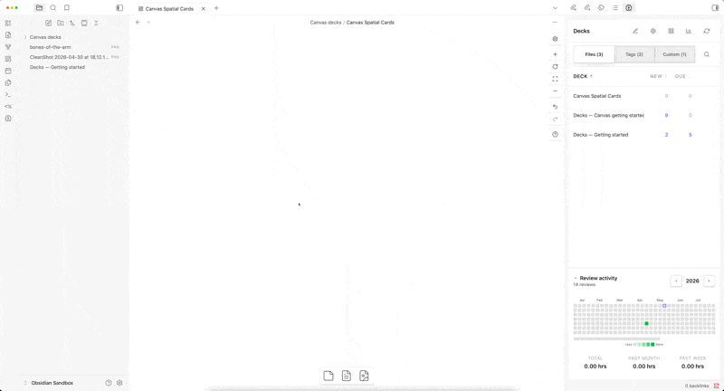

# Decks   

[English](./README.md) · [Deutsch](./README.de.md) · [Español](./README.es.md) · **Français** · [Italiano](./README.it.md) · [Русский](./README.ru.md) · [Türkçe](./README.tr.md) · [Shqip](./README.sq.md) · [العربية](./README.ar.md) · [हिन्दी](./README.hi.md) · [中文](./README.zh.md) · [繁體中文](./README.zh-TW.md) · [日本語](./README.ja.md)

**Transformez vos notes Obsidian en cartes mémoire (flashcards). Aucune syntaxe spéciale. Aucun paquet séparé à construire.**

Ajoutez la balise `#decks` à un fichier. Chaque en-tête `##` devient le recto d'une carte ; le texte en dessous devient le verso. Les tableaux, les images masquées et les textes surlignés `==cloze==` fonctionnent de la même manière. La planification est gérée par FSRS — l'algorithme moderne de répétition espacée.


[Discord](https://discord.com/channels/686053708261228577/1497268419861418035) · [Notes de version](./release-notes/) · [Offrez-moi un café](https://www.buymeacoffee.com/dscherdil0)

## Pourquoi Decks

- **Vos notes sont déjà le paquet.** Balisez un fichier : chaque en-tête au niveau que vous choisissez devient un recto et le texte en dessous devient un verso. Si vous venez d'Anki, il n'y a rien à rédiger deux fois.
- **Quatre formats, aucune syntaxe à apprendre.** En-têtes, tableaux à deux colonnes, masquage d'images et textes à trous `==cloze==` à partir des surlignages que vous utilisez déjà.
- **Planification native FSRS.** Trois profils (Standard / Intensif / Entraîné), cibles de rétention par balise, sans les contraintes de SM-2.
- **Ajustement de l'algorithme.** L'optimiseur en un clic entraîne les poids FSRS sur votre propre historique de révision — une meilleure planification pour votre courbe d'oubli, le tout côté client.
- **Véritable synchronisation multi-appareils.** La base de données fusionne automatiquement via iCloud/Dropbox — révisez sur téléphone et sur bureau, sans perte d'historique.
- **Conçu pour le mobile.** Interface de révision optimisée pour le tactile, adaptée aux zones sécurisées (safe-area), testée quotidiennement sur téléphones.

## Démarrage rapide en 60 secondes

1. Installez **Decks** depuis les plugins communautaires et activez-le.
2. Ouvrez n'importe quelle note. Ajoutez `#decks` dans le frontmatter ou comme balise dans le texte.
3. Écrivez un en-tête `##`, puis un paragraphe en dessous. Répétez l'opération pour autant de cartes que vous le souhaitez :

   ```markdown
   ---
   tags: [decks/anglais]
   ---

   ## Que signifie "Hola" en anglais ?

   Hello.

   ## Comment dit-on "Merci" en anglais ?

   Thank you.
   ```

4. Cliquez sur l'**icône de cerveau** dans la barre latérale pour ouvrir le panneau Decks. Cliquez sur votre fichier. Commencez à réviser.

Le nom du fichier devient le nom du paquet. Les cartes se synchronisent automatiquement lorsque vous sauvegardez la note.

## Formats de cartes

Decks propose quatre façons de rédiger vos cartes. Choisissez celle qui correspond le mieux à votre façon d'écrire.

<details>
<summary><b>En-tête + paragraphe</b> — le format par défaut. Chaque en-tête au niveau configuré (H2 par défaut) est un recto ; le corps en dessous est le verso.</summary>

```markdown
---
tags: [decks/anglais]
---

## Que signifie "Hola" en anglais ?

Hello.

## Comment dit-on "Merci" en anglais ?

Thank you.
```

Le nom du fichier devient le nom du paquet. Le niveau d'en-tête est configurable par profil (H2 par défaut). Les en-têtes au-dessus du niveau configuré ne deviennent pas des cartes — ils sont conservés sous forme de fil d'Ariane (par ex. `Chapitre 1 > Section 2`) attaché à chaque carte pour le contexte.

</details>

<details>
<summary><b>Tableaux</b> — tableaux markdown à deux colonnes, avec une colonne optionnelle pour les notes.</summary>

```markdown
## Concepts

| Question                         | Réponse                                                         |
| -------------------------------- | --------------------------------------------------------------- |
| Qu'est-ce que la photosynthèse ? | Le processus qu'utilisent les plantes pour convertir la lumière |
| Définir la gravité               | La force qui attire les objets les uns vers les autres          |
```

- Première colonne = recto, deuxième colonne = verso. La ligne d'en-tête est ignorée.
- Les tableaux doivent se trouver directement sous un en-tête (sans autres paragraphes à l'intérieur).
- Ajoutez une troisième colonne "Notes" pour les indices/moyens mnémotechniques, affichables en appuyant sur **N** pendant la révision.

</details>

<details>
<summary><b>Textes à trous (Cloze)</b> — surlignez du texte avec <code>==texte==</code> pour le masquer.</summary>

```markdown
## Le système solaire

Le ==Soleil== est l'étoile au centre de notre système solaire. La planète la plus proche est ==Mercure==, et la plus grande est ==Jupiter==.
```

Chaque surlignage devient une carte. Pendant la révision, le trou actif s'affiche sous la forme `[...]` ; touchez pour le révéler. Les textes à trous fonctionnent aussi dans les cellules des tableaux. Deux modes de contexte par profil (masquer ou afficher les autres trous). Activado por defecto.

</details>

<details>
<summary><b>Masquage d'image</b> — une image et une liste numérotée. Les numéros sur l'image correspondent à la liste.</summary>

```markdown
## Os du bras

![[arm_bones.png]]

1. ==Humérus==
2. ==Radius==
3. ==Ulna (Cubitus)==
```

Chaque élément de la liste est une carte. L'image (avec ses étiquettes numérotées) s'affiche au recto ; l'élément correspondant est masqué au verso. Cette fonctionnalité s'appuie sur les textes à trous (cloze), qui doivent donc être activés sur le profil.

</details>

<details>
<summary><b>Plus : format titre, cartes inversées, balises par carte</b></summary>

**Format titre** — le nom du fichier devient le recto, le fichier entier devient le verso. Définissez "Titre" comme niveau d'en-tête dans votre profil.

**Cartes inversées** — ajoutez `reverse: true` dans le frontmatter d'un fichier pour générer automatiquement une copie inversée de chaque carte. La progression est suivie séparément pour chaque sens.

**Balises par carte** — ajoutez `#balise` directement dans les en-têtes (ex. `## Qu'est-ce que la photosynthèse ? #plantes #lycée`). Les balises sont supprimées du recto affiché, apparaissent comme des puces pendant la révision, et sont héritées par les lignes de tableau et les cartes inversées. Créez des "paquets de filtres" qui regroupent toutes les cartes contenant une balise donnée dans l'ensemble de votre coffre (vault).

</details>

### Paquets canvas

Créez des cartes sur un canvas Obsidian (`.canvas`) au lieu d'un fichier Markdown. Chaque canvas dans le dossier configuré devient un paquet ; chaque nœud texte est analysé avec les mêmes quatre formats de carte ci-dessus. Configurez via **Paramètres → Paquets canvas** : dossier et étiquette (par défaut `#decks/canvas`). « Aller à la source » depuis la révision ouvre le canvas et met le focus sur le nœud d'origine. À la première installation (ou mise à jour), un fichier `Decks — Démarrer avec canvas.canvas` est créé automatiquement dans le dossier `Canvas decks/`.

**Cartes spatiales (Spatial cards)** : reliez des nœuds texte par des arêtes — chaque arête devient une carte : le nœud source est le recto (question), le nœud cible est le verso (réponse), et le libellé de l'arête sert d'indice optionnel. Les chaînes (A → B → C), les relations un-vers-plusieurs et plusieurs-vers-un fonctionnent toutes ; les nœuds non connectés continuent d'être analysés avec les quatre formats ci-dessus. Détails dans **[docs/CANVAS_DECKS.md](docs/CANVAS_DECKS.md)**.



## Ce que vous obtenez

- Mode navigation et sessions de révision chronométrées avec limites journalières.
- Profils par balise (FSRS Standard / Intensif, cible de rétention, quotas journaliers).
- Paquets personnalisés construits à partir de règles de filtre — ex., toutes les cartes balisées `#lycée`.
- Statistiques : carte thermique (heatmap), rétention, prévisions des révisions futures, intervalles, répartition horaire, statistiques des boutons de réponse.
- Exportation Anki, sauvegardes automatiques, synchronisation avec fusion multi-appareils.
- Raccourcis clavier : **Espace** pour retourner, **1–4** pour évaluer.

## Planification personnalisée

FSRS est livré avec des paramètres par défaut judicieux qui fonctionnent très bien immédiatement. Une fois que vous avez accumulé environ 100 révisions, vous pouvez entraîner les 21 poids de l'algorithme sur votre propre historique de révisions pour obtenir des planifications adaptées à votre courbe d'oubli spécifique — le même type de chose qu'Anki de bureau fait, mais côté client, sans serveur et sans télémétrie.

**Paramètres → Ajustement de l'algorithme → Optimiser les paramètres.** L'entraînement s'exécute en quelques secondes pour les paquets typiques ; vous verrez une comparaison de perte logarithmique (log-loss) avant/après. Cliquez sur Appliquer pour utiliser les poids entraînés ou Ignorer pour conserver les valeurs par défaut.

## Notes de version & Support

- Les **Notes de version** pour chaque mise à jour se trouvent dans [`release-notes/`](./release-notes/).
- **Discutez sur Discord** — [rejoignez le serveur](https://discord.com/channels/686053708261228577/1497268419861418035).
- **Soutenez le développement** — [Offrez-moi un café](https://www.buymeacoffee.com/dscherdil0).
- **Guide de traduction** - [Guide de traduction](./docs/TRANSLATING.md).

## Licence

Voir [LICENSE](./LICENSE).

---

> Cette traduction est une ébauche — les Pull Requests de locuteurs natifs sont les bienvenues.
