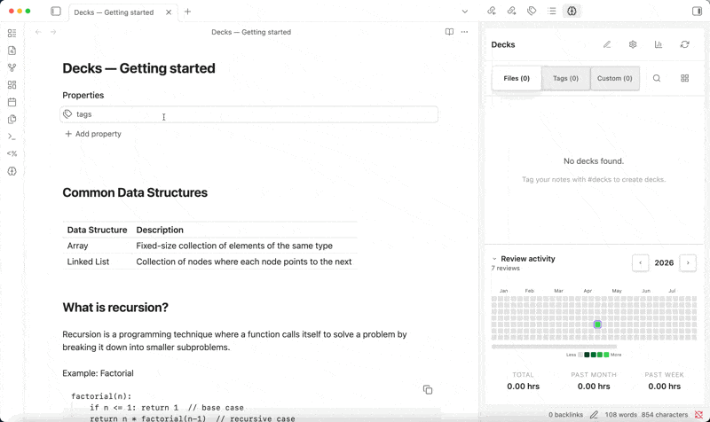

# Decks [](https://github.com/dscherdi/decks/actions/workflows/release.yml)

Decks is a powerful spaced repetition flashcard plugin for Obsidian that helps you learn and memorize information efficiently using the FSRS algorithm, built with TypeScript and Svelte for a reactive and type-safe UI.

If you like this plugin, consider buying me a coffee and I will add more features.
<a href="https://www.buymeacoffee.com/dscherdil0">
  
</a>

## Demo



## Quick Start

1. **Install the Plugin**: Download and enable Decks in your Obsidian plugins
2. **Open the Panel**: Click the brain icon in the ribbon or use the command palette
3. **Create Your First Deck**: Follow the guide below to create flashcards
4. **Start Learning**: Click on any deck to begin reviewing flashcards

## Creating Flashcards

### 📝 Method 1: Header + Paragraph Format

Create a markdown file and tag it with `#flashcards`:

```markdown
---
tags: [flashcards/spanish-basics]
---

# What does "Hola" mean in English?
Hello

# How do you say "Thank you" in Spanish?
Gracias

# What is the Spanish word for "water"?
Agua
```

**How it works:**
- Each header becomes the **front** of a flashcard
- All content until the next header becomes the **back**
- The filename becomes your deck name
- Cards are automatically extracted and synced

### 📊 Method 2: Table Format

Create flashcards using a two-column table:

```markdown
---
tags: [flashcards/vocabulary]
---

| Question | Answer |
|----------|---------|
| What is photosynthesis? | The process by which plants convert sunlight into energy |
| Define gravity | The force that attracts objects toward each other |
| What is DNA? | Deoxyribonucleic acid - carries genetic information |
```

**How it works:**
- First column = **front** of flashcard
- Second column = **back** of flashcard
- Header row is ignored
- Perfect for structured Q&A format

### 🎯 Best Practices

- **Use descriptive tags**: `#flashcards/spanish-verbs` instead of `#flashcards/deck1`
- **Keep cards atomic**: One concept per card
- **Use images and formatting**: Markdown formatting is fully supported
- **Organize by topic**: Group related concepts in the same deck

## Key Concepts

### 🧠 Learning States

**New Cards** 🆕
- Cards you've never seen before
- Shown first in each review session
- Default limit: 20 new cards per day

**Learning Cards** 📚
- Cards in short-term review cycle
- Use fixed intervals: 1min → 10min → 1 day
- Help reinforce new information while fresh

**Due Cards** ⏰
- Part of long-term spaced repetition
- Scheduled based on your performance
- Intervals grow with successful reviews

### ⚡ FSRS Algorithm

Decks uses the **Free Spaced Repetition Scheduler (FSRS)**, a modern algorithm that:

- **Adapts to your performance**: Cards you struggle with appear more frequently
- **Optimizes retention**: Maximizes what you remember with minimal reviews
- **Predicts forgetting**: Schedules reviews just before you'd forget
- **Learns your patterns**: Improves scheduling based on your review history

### 🎮 Review Process

When reviewing flashcards, you have four difficulty options:

**Again** 🔄 (Red)
- "I don't remember this at all"
- Resets the card to learning state
- Shows the card again soon

**Hard** 😅 (Orange)
- "I struggled but got it eventually"
- Increases interval slightly
- Shorter than normal spacing

**Good** ✅ (Green)
- "I remembered it correctly"
- Normal interval increase
- Default choice for successful recall

**Easy** 🚀 (Blue)
- "Too easy, I know this well"
- Longer interval increase
- Use sparingly for very familiar content

### 📊 Understanding Your Stats

**Daily Progress**
- Track new cards learned
- Monitor review accuracy
- See time spent studying

**Forecast**
- Predict future review workload
- Plan your study schedule
- Understand long-term commitments

**Retention Rate**
- Measure how well you're remembering
- Identify problematic topics
- Adjust study strategies

## How to Use

### 🚀 Getting Started

1. **Create a deck**: Make a markdown file with `#flashcards` tag
2. **Add flashcards**: Use headers+paragraphs or table format
3. **Open Decks panel**: Click the brain icon in the sidebar
4. **Start reviewing**: Click on any deck to begin

### 📈 Daily Workflow

1. **Check your dashboard**: See what's due today
2. **Review due cards**: Handle spaced repetition reviews first
3. **Learn new cards**: Add new knowledge within daily limits
4. **Check progress**: Monitor your learning statistics

### ⚙️ Configuration

Access deck settings to customize:
- Daily new card limits
- Review order preferences
- Deck-specific configurations
- FSRS algorithm parameters

### Features

- **Smart Parsing**: Automatically extracts flashcards from markdown headers and paragraphs
- **FSRS Algorithm**: Uses the latest Free Spaced Repetition Scheduler for optimal learning
- **Rich Statistics**: Track your learning progress with detailed analytics
- **Deck Management**: Organize flashcards by tags and configure review limits
- **Review Heatmap**: Visualize your review activity over time
- **Time Tracking**: Monitor your review pace and efficiency

## 🛠️ Development

### Building from Source

```bash
# Clone the repository
git clone https://github.com/dscherdi/decks.git
cd decks

# Install dependencies
npm install

# Build for development
npm run build:dev

# Run tests
npm test

# Build for production
npm run build

# Build for release (includes README/LICENSE)
npm run build:release


```

### Release Process

This plugin uses automated GitHub Actions for releases:

1. **Create a version tag**: `git tag v1.2.3 && git push origin v1.2.3`
2. **GitHub Actions automatically**:
   - Runs all tests
   - Builds the plugin with all assets in `dist/`
   - Generates release notes from PROGRESS.md
   - Creates GitHub release with all `dist/` files
   - Validates all files before release

### Release Contents (dist/)

Each release includes:
- `main.js` (238 KB) - Core plugin code
- `styles.css` (63 KB) - Plugin styling
- `manifest.json` - Plugin manifest
- `database-worker.js` (4 KB) - Database worker thread
- `assets/sql-wasm.js` (48 KB) - SQL.js JavaScript
- `assets/sql-wasm.wasm` (644 KB) - WebAssembly binary
- `README.md` & `LICENSE` - Documentation

Total release size: ~1MB

### Architecture

- **Frontend**: Svelte components with TypeScript
- **Database**: SQLite via sql.js with optional worker thread
- **Algorithm**: FSRS-4.5 spaced repetition
- **Build**: esbuild with production optimizations
