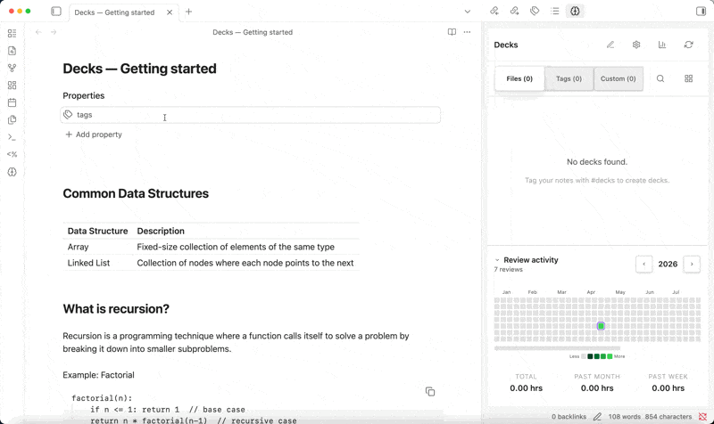

# Decks

Decks is a spaced repetition flashcard plugin for Obsidian that helps you learn and memorize information using the FSRS algorithm.

If you like this plugin, consider buying me a coffee and I will add more features.
<a href="https://www.buymeacoffee.com/dscherdil0">

</a>

## Demo



## Quick start

1. **Install the plugin**: Download and enable Decks in your Obsidian plugins
2. **Open the panel**: Click the brain icon in the ribbon or use the command palette
3. **Create your first deck**: Follow the guide below to create flashcards
4. **Start learning**: Click on any deck to begin reviewing flashcards

## Creating flashcards

### Header + paragraph format

Create a markdown file and tag it with `#flashcards`:

```markdown
---
tags: [flashcards/spanish-basics]
---

# What does "Hola" mean in English?

Hello

# How do you say "Thank you" in Spanish?

Gracias

# What is the Spanish word for "water"?

Agua
```

- Each header becomes the **front** of a flashcard
- All content until the next header becomes the **back**
- The filename becomes your deck name
- Cards are automatically extracted and synced

### Table format

Create flashcards using a two-column table:

```markdown
---
tags: [flashcards/vocabulary]
---

## Concepts

| Question                | Answer                                                   |
| ----------------------- | -------------------------------------------------------- |
| What is photosynthesis? | The process by which plants convert sunlight into energy |
| Define gravity          | The force that attracts objects toward each other        |
| What is DNA?            | Deoxyribonucleic acid - carries genetic information      |
```

- First column = **front** of flashcard
- Second column = **back** of flashcard
- Header row is ignored
- Tables need to be inside a header with header level specified in the settings to be parsed.
- There should not be any other paragraphs in the header together with the table, because then it will be parsed as a Header+Paragraph Block

#### Optional notes column

You can add a third column for notes that provide extra context, hints, or mnemonics. Notes are shown during review via a toggle button on the back of the card.

```markdown
## Spanish vocabulary

| Front               | Back        | Notes                                        |
| -------------------- | ----------- | -------------------------------------------- |
| Hola                 | Hello       | Informal greeting, used with friends         |
| Buenos días          | Good morning| Literally "good days", used until noon       |
| Gracias              | Thank you   | Add "muchas" for "thank you very much"       |
| ¿Cómo estás?         | How are you?|                                              |
```

- The notes column is optional — tables without it work the same as before
- Empty notes cells are allowed
- During review, a small info icon appears on the back card when notes are available
- Press **N** to toggle notes visibility

### Tips

- **Use descriptive tags**: `#flashcards/spanish-verbs` instead of `#flashcards/deck1`
- **Keep cards atomic**: One concept per card
- **Use images and formatting**: Markdown formatting is fully supported
- **Organize by topic**: Group related concepts in the same deck

## Key concepts

### Learning states

- **New**: Cards you have never seen before
- **Learning**: Cards in short-term review cycle with short intervals
- **Due**: Cards scheduled for long-term spaced repetition review
- **Mature**: Cards with an interval of 21 days or more

### FSRS algorithm

Decks uses the Free Spaced Repetition Scheduler (FSRS), a modern algorithm that adapts to your performance, optimizes retention, and predicts when you are about to forget. Two built-in profiles are available:

- **Standard**: Balanced scheduling for everyday learning
- **Intensive**: Shorter intervals for aggressive memorization

### Review ratings

When reviewing flashcards you rate each card:

- **Again**: I don't remember this at all. Resets the card to learning state.
- **Hard**: I struggled but got it eventually. Shorter than normal spacing.
- **Good**: I remembered it correctly. Normal interval increase.
- **Easy**: Too easy, I know this well. Longer interval increase.

## Features

### Deck profiles

Create custom profiles with configurable daily limits for new and review cards, retention targets, and FSRS algorithm selection. Profiles are assigned to tags so all decks under a tag share the same settings. Each deck in a tag group enforces its own daily quota.

### Browse mode

Browse all cards in a deck or tag group without affecting their scheduling state. Navigate forward and backward through the full card list.

### Review sessions

Timed review sessions with a configurable duration (default 25 minutes). A progress bar tracks how many cards you have reviewed toward the session goal, which respects your daily limits.

### Keyboard shortcuts

During review:

- **Space**: Show answer or move to next card
- **1**: Again
- **2**: Hard
- **3**: Good
- **4**: Easy

### Statistics

Track your learning with detailed analytics:

- Study time (today, this week, this month, all time)
- Card state breakdown (new, learning, review, mature)
- Review heatmap calendar
- Charts: reviews over time, stability distribution, future due forecast, maturity progression, hourly breakdown, answer button stats
- Per-deck and overall statistics

### Anki export

Export flashcards to Anki-compatible format with configurable deck names and note types.

### Multi-device sync

Works with Dropbox, iCloud, or any file sync service. When the database is modified on multiple devices, Decks merges the changes automatically — review history is preserved from both sides and cards use the most recently modified version.

### Mobile support

Fully responsive design for Obsidian mobile with touch-friendly buttons and safe-area handling.

## Configuration

Access settings from Obsidian Settings > Decks.

### Profiles

Open the Profiles Manager from the deck list panel to create and edit profiles. Each profile controls:

- **New cards per day**: Limit how many new cards are introduced daily (per deck)
- **Review cards per day**: Limit how many review cards are shown daily (per deck)
- **Retention target**: How well you want to remember cards (default 90%)
- **FSRS profile**: Standard or Intensive algorithm weights
- **Header level**: Which header level to use for parsing flashcards
- **Review order**: Oldest due first or random

Assign a profile to a tag from the gear icon on any deck or tag group in the deck list.

### Review settings

- **Session duration**: How long each review session lasts (1-60 minutes)
- **Next day starts at**: When the study day rolls over (default 4:00 AM)
- **Keyboard shortcuts**: Enable or disable keyboard shortcuts during review

### Parsing settings

- **Search path**: Scan the entire vault or restrict to a specific folder

### Other settings

- **Background refresh**: Automatically refresh the deck list on an interval
- **Automatic backups**: Keep up to N database backups
- **Debug logging**: Enable detailed logging for troubleshooting

## Release notes

Release notes for each version are in the `release-notes/` folder.
